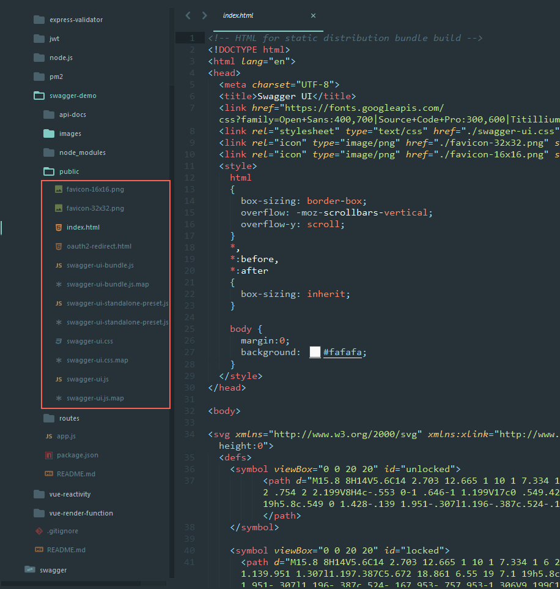

### Swagger使用手册
Swagger主要分为三部分：
- [Swagger-Edit](https://editor.swagger.io//?_ga=2.122769356.614048866.1505981564-284440666.1505981564#/)
  在线编辑OAS([OpenAPI Specification](https://github.com/OAI/OpenAPI-Specification))
- [Swagger-Codegen](https://swagger.io/swagger-codegen/)
  编辑好OAS后，生成各种语言的服务器端代码
- [Swagger UI](https://swagger.io/swagger-ui/)
  导入OPA文件即可进行API请求交互

在这里只使用到了Swagger UI,以及[swagger-jsdoc](https://github.com/Surnet/swagger-jsdoc)库（将文件中的注释转为OAS文件）

安装及使用：
1. 全局安装swagger-jsdoc

  ```
  $ npm install swagger-jsdoc -g
 
  ```

2. 下载Swagger UI 地址：[https://github.com/swagger-api/](https://github.com/swagger-api/),取出swagger-ui里面的dist文件取出，作为静态文件使用，用node建立服务：
 
 

3. 定义swaggerDef.js文件
 
4. 将文件中的注释转为OAS文件,注释需遵循[OpenAPI Specification 3.0](https://github.com/OAI/OpenAPI-Specification)规范，并加一个@swagger头

注释例子：
 

运行命令生成OAS文件，文件名api-docs.json

  ```
  swagger-jsdoc -d ./api-docs/swaggerDef.js  routes/*.js -o ./api-docs/api-docs.json -w
  ```

生成的文件如下：


5. 将api-docs.json作为静态文件返回：


7. 更改Swagger UI 中的index.html文件


8. 开启node.js服务

```
$ node app.js
```

访问 http://localhost:4000/swagger/index.html  即可
